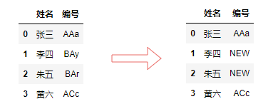
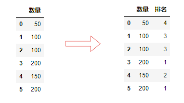
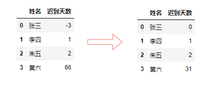
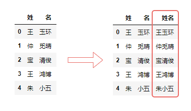
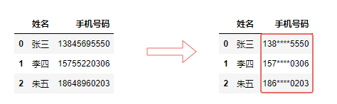
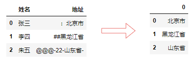

[pandas用法-全网最详细教程](https://blog.csdn.net/yiyele/article/details/80605909)

[Pandas常见用法总结](https://www.shuzhiduo.com/A/MyJx2DkXdn/)

> Pandas 是基于NumPy的一种工具，该工具是为解决数据分析任务而创建的。它提供了大量能使我们快速便捷地处理数据的函数和方法。 


1. #### 查看

- df.head([n])  查看前n行，n可以缺省
- df.tail([n])   查看最后n行，n可以缺省
- df.sample([n])  查看随机n行，n可以缺省
- df.shape   查看表行列数
- df.columns   查看所有列名

2. #### 缺失值与重复值 

 Pandas清洗数据时，判断缺失值一般采用`isnull()`方法。此外，`isnull().any()`会判断哪些”列”存在缺失值，`isnull().sum()`用于将列中为空的个数统计出来。 

```
df.isnull().any()
输出：
日期    False
销量    True
dtype: bool

```

 发现“销量”这列存在缺失值后，处理办法要么删除`dropna()` ，要么填充`fillna()`。 

```
给所有空值填入50
df.fillna(50)
```

3. #### 数值数据操作

#####  replace() 正则替换

```
df["编号"].replace(r'BA.$', value='NEW', regex=True, inplace = True)
```



#####  `rank()`⽅法可以实现数据排名 

详细讲解：[pandas rank()函数简介](https://www.cnblogs.com/mrlayfolk/p/12254287.html)

```
df["排名"] = df.rank(method="dense").astype("int")
```



#####   `clip()`方法，

用于对超过或者低于某些数的数值进行截断[1]，来保证数值在一定范围 

```
df["迟到天数"] = df["迟到天数"].clip(0,31)
```



#####  **唯一值** 

 `unique()`是以数组形式返回列的所有唯一值，而`nunique()`返回的是唯一值的个数。 

```
df["gender"].unique()
df["gender"].nunique()
```

##### apply

 `apply()`函数的功能是将一个自定义函数作用于DataFrame的行或者列；`applymap()`函数的功能是将自定义函数作用于DataFrame的所有元素。他们通常也与匿名函数lambda一起使用。 

```
df["数量"].apply(lambda x: x+1)
```


#### 文本数据操作

 [经常被人忽视的：Pandas 文本型数据处理](https://mp.weixin.qq.com/s?__biz=MzU5Nzg5ODQ3NQ==&mid=2247519123&idx=2&sn=d5ada621cf5257a775ad037eac57aa4f&chksm=fe4eae17c9392701573719506db173ab2968c6a8b12fb9f37748224b2efd60f2bdf1a5a96978&scene=21#wechat_redirect) 

|       函数方法        | 用法释义                                           |
| :-------------------: | :------------------------------------------------- |
|          cat          | 字符串的拼接                                       |
|       contains        | 判断某个字符串是否包含给定字符                     |
|  startswith/endswith  | 判断某个字符串是否以...开头/结尾                   |
|          get          | 获取指定位置的字符串                               |
|          len          | 计算字符串长度                                     |
|     upper、lower      | 英文大小写转换                                     |
|      pad/center       | 在字符串的左边、右边或左右两边添加给定字符         |
|        repeat         | 重复字符串几次                                     |
|     slice_replace     | 使用给定的字符串，替换指定的位置的字符             |
|         split         | 分割字符串，将一列扩展为多列                       |
| strip、rstrip、lstrip | 去除空白符、换行符                                 |
|        findall        | 利用正则表达式，去字符串中匹配，返回查找结果的列表 |
|  extract、extractall  | 接受正则表达式，抽取匹配的字符串(一定要加上括号)   |

 **举例：** 

```
df.insert(2, "姓名", 
          df["姓"].str.cat(df["名"], sep=""))
```



```
df["手机号码"] = df["手机号码"].str.slice_replace(3,7,"*"*4)
```



```
df["地址"].str.extract("([\u4e00-\u9fa5]+)")  
```




#### 读取表格文件

```
import pandas as pd
pd.read_csv(csv_path, usecols=['col_name1', 'col_name2'], encoding='gbk')

pd.read_excel(excel_path, usecols=['col_name1', 'col_name2'])
```

#### 遍历文件夹

```python
import os
dirs = os.listdir(file_dir)
for dir in dirs:
    dir_path = os.path.join(file_dir, dir)
    for root, subDirs, files in os.walk(dir_path):
        # root 所有目录包含子目录文件夹目录的文件夹路径
        # subDirs 所有目录包含子目录文件夹下的文件夹名称
        # files 所有目录包含子目录文件夹下的文件名称
```

#### 创建DataFrame

```
empty_data = pd.DataFrame([], columns=['',''])
```

#### 处理数据

```
# 遍历表格处理
data.apply(lambda x: x['colName1'].strip('\t'), axis = 1)

# 表格合并
data_concat = pd.concat(data1, data2)

# 表格关联
data_merge = data1.merge(data2, left_on = 'data1_col', right_on = 'data2_col', how = 'right')


```

